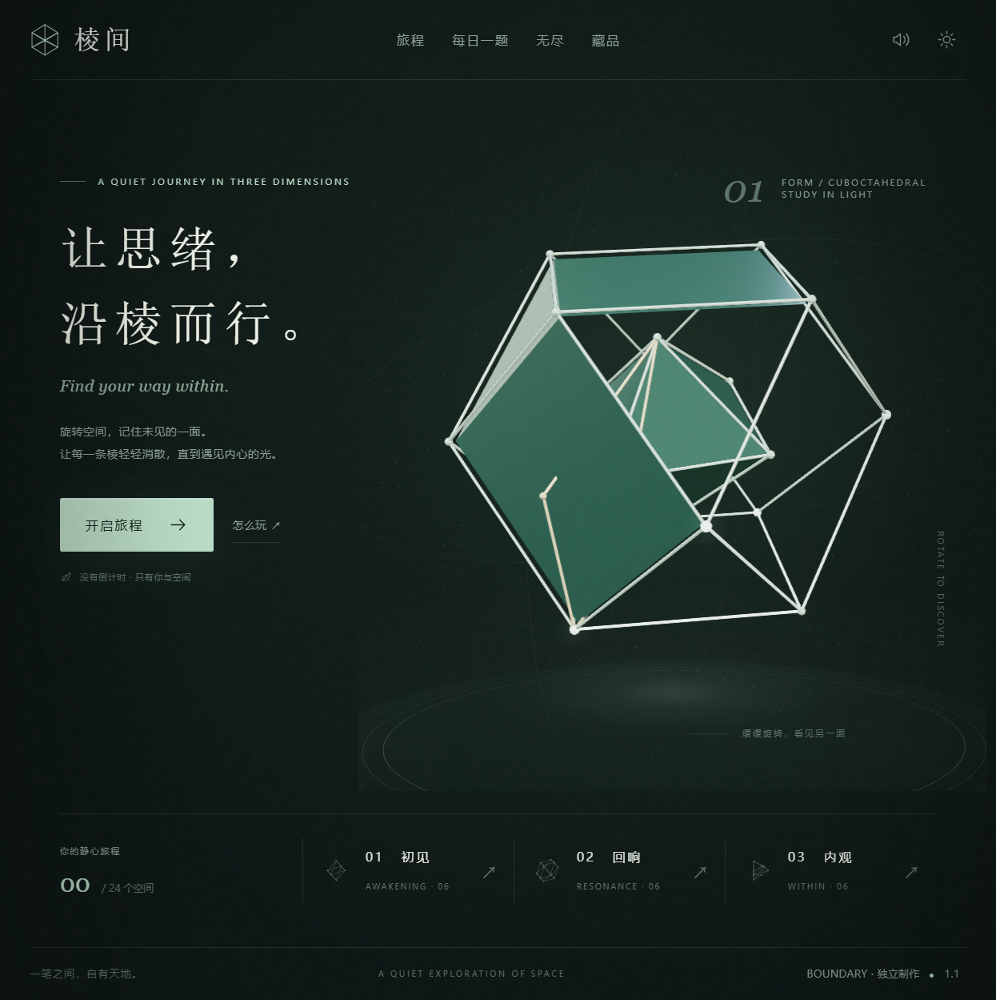

# 棱间 · BOUNDARY

一款探索空间拓扑与极简几何美感的三维欧拉路径交互游戏。玩家在旋转的多面体与高维流形中，依循欧拉回路遍历每一条空间棱边并回归起点。

## 作品定位与核心机制

- **三维欧拉路径闭环**：在 24 个手工设计与程序化多面体（正多面体、星形体、递归分形空间）上完成“一笔画”遍历，所有棱边仅且必须经过一次。
- **程序化每日一题**：内置确定性 PRNG 伪随机数生成器，根据玩家本机日期生成全球统一的每日谜题，并在前端自闭环保证数学可解性。
- **空间感知与辅助工具**：支持三维全向无死角旋转、历史行进路径自发光回溯、撤销/重做栈与本地最佳解记录。

## 技术架构与算法实现

本项目坚持“算法先验、规则与表现严格隔离”的设计哲学，将复杂的图论求解与几何拓扑封装于轻量化前端架构中：

### 1. 图论算法与拓扑可解性引擎
- **Hierholzer 算法残余图检测**：玩家每次落步，引擎立即在残余图（Residual Graph）上运行 Hierholzer 算法分支，毫秒级验证剩余图是否仍存在有效欧拉回路，提供确定性的死局判定与回溯提示。
- **拓扑自修补算法 (`eulerize`)**：针对非欧拉多面体图结构，自研修补算法自动检索全部奇度（Odd-Degree）顶点，以球面最短测地线向外凸起特定弧度，动态生成可见的“圆弧几何桥接肋条”，在保留原始造型艺术感的同时恢复全局连通性与回路可解性。

### 2. 三维空间拾取与视觉管线
- **半球法线遮挡优化**：在 Raycaster 屏幕拾取时，将视线向量与顶点法向量进行点积计算，主动剔除背半球棱边与遮蔽物，彻底解决三维透视投射下的高频误触痛点。
- **软深度幕（Soft Depth Veil）**：使用渐进式视距色彩衰减替代 WebGL 原生生硬的远截断面，在暗色深空环境中营造空灵柔和的空间纵深。

### 3. 纯代码程序化声音系统
- **无采样音频合成**：零外部音频文件依赖，基于 **Web Audio API** 纯代码实时合成所有音效。
- **晶体质感调频**：使用正弦波加微量谐波叠加与指数级自然衰减包络，实时合成清脆的水晶敲击音、空间转向音与通关共鸣谐音。

## 交付标准与工程规范

- **单文件自包含交付**：HTML、CSS、JavaScript 与内嵌 Three.js 统一打包为单个离线文件，本地 `file://` 双击即跑，无 CDN 故障或断网风险。
- **双模输入与平滑交互**：同时适配桌面端鼠标滚轮/拖拽与移动端双指触控，内置惯性阻尼与旋转动量平滑衰减。
- **数据持久化与导出**：通关进度、步数、时间与自设种子数据保存在 `localStorage`，支持 JSON 格式的一键备份与跨设备导入。

## 工程能力迁移与应用场景

本项目中实现的图论算法与空间交互可直接类比并迁移至以下企业级业务场景：
- **高维拓扑网络与链路图谱可视化**：将“基于 Hierholzer 的残余图实时可解性检测”迁移至复杂通信网络、供应链流向图谱与电力拓扑遍历，毫秒级定位关键阻断节点与环路状态。
- **工业构件表面无重复巡检规划**：将“三维欧拉路径闭环遍历”迁移至无人机表面测绘、机械臂探伤或激光全覆盖扫描的“单笔无重复全局遍历”路径规划。
- **空间网架结构体检与拓扑自修复**：将“`eulerize` 奇度节点圆弧桥接算法”迁移至 BIM/CAD 三维桁架网架的连通性体检，自动识别断头节点并根据几何曲率执行规则化桥接加固。

## 快速游玩与操作

1. **直接游玩**：下载仓库后，使用桌面 Chrome / Edge 浏览器直接打开 `index.html`，无需安装环境。
2. **操作说明**：
   - 鼠标左键拖拽（或触屏单指滑动）旋转几何体；
   - 滚轮（或双指捏合）缩放视角；
   - 点击顶点沿棱边前进；支持快捷键 `Z` 撤销、`Y` 重做。

## 版权

作品代码与原创内容保留全部权利。内嵌的 Three.js 使用 MIT License，许可正文随 `index.html` 一并分发。
